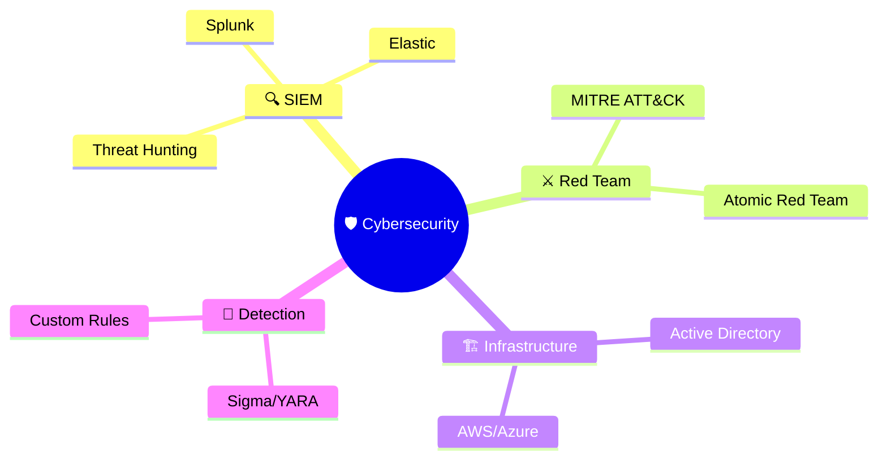

# 👋 Hi, I'm Devon Booker (@d3vhackz)

 <!-- You can replace this with a custom banner image -->

Cybersecurity Engineer and Detection Specialist passionate about building secure ecosystems and outsmarting threats. I design enterprise-grade homelabs, craft detection rules, and simulate real-world attacks to strengthen defenses.

- 📍 **Location**: San Antonio, Texas
- 🔗 **LinkedIn**: [d3vhackz](https://www.linkedin.com/in/d3vhackz)
- 🌐 **Website**: (Add if available)

## 🎯 Expertise
- 🔬 **SIEM Engineering** (Splunk, Elastic) & Threat Hunting
- ⚔️ **Red/Purple Team Operations** (MITRE ATT&CK, Atomic Red Team)
- 🏗️ **Secure Infrastructure** (Active Directory, AWS, Terraform)
- 💻 **Detection-as-Code** (Sigma, YARA, PowerShell)

## 🏆 Featured Project: Splunk Homelab
A production-grade SIEM homelab simulating a SOC environment with Splunk, Sysmon, and multi-OS setups.

### Architecture
```
d3vhackz.local (192.168.10.0/24)
- 🖥️ AD Controller
- 🔍 Splunk SIEM
- 💻 Win10 Endpoint
- 🐧 Kali Linux
- 🔧 Ubuntu
- 🎯 Atomic Red Team
- 🚨 Sysmon
- ⚡ Universal Forwarder
```

### ⚔️ MITRE ATT&CK Examples
- **Persistence**: T1136.001 (Account Creation)
- **Credential Access**: T1110.003 (Password Spraying)
- **Defense Evasion**: T1055 (Process Injection)

### 🚀 Quick Start
1. Clone the repo: `git clone https://github.com/d3vhackz/splunk-homelab`
2. Set up VMs (VMware recommended) on 192.168.10.0/24.
3. Install Splunk, Sysmon, and Universal Forwarder.
4. Simulate attacks with Kali Linux (e.g., Invoke-Mimikatz).
5. Query Splunk: `index=main sourcetype=XmlWinEventLog:Microsoft-Windows-Sysmon/Operational`.

Explore the [repo](https://github.com/d3vhackz/splunk-homelab) for setup guides and detection queries.

## 🔥 Technology Arsenal
### Security & Monitoring
- Splunk
- Elastic
- Sysmon
- Sigma
- YARA

### Offensive Security
- MITRE ATT&CK
- Atomic Red Team
- Kali Linux

### Cloud & Infrastructure
- AWS
- Azure
- Terraform
- Active Directory

### Development & Automation
- Python
- PowerShell

## 📊 Skills & Analytics


## 📈 GitHub Stats


## 🌟 Research & Impact
| 🔬 Area          | 📊 Impact | 🛠️ Tools              | 📈 Status |
|------------------|-----------|-----------------------|----------|
| SIEM Detection   | High     | Splunk, Sigma        | 🟢 Active |
| Threat Simulation| Critical | Atomic Red Team      | 🟢 Active |
| Cloud Security   | High     | AWS, Terraform       | 🟡 Planning |

## 🔗 Connect with Me
- [](https://www.linkedin.com/in/d3vhackz)
- [](https://github.com/d3vhackz)
- [](https://x.com/yourusername) <!-- Add if available -->

## 🎯 Mission
"Building proactive defenses through SIEM, simulations, and relentless threat hunting to secure the digital world."

⚡ **"Security is a mindset, not a wall."**

Made with 💀 by d3vhackz | Updated: July 18, 2025
