#  D3VHACKZ 

<div align="center">

[](https://git.io/typing-svg)

</div>

---


### 🚀 Elite Security Professional & Detection Engineer

I architect advanced security infrastructures and develop sophisticated detection mechanisms that identify threats before they become incidents. My passion lies in building comprehensive security environments that simulate real-world enterprise networks.

**🎯 Current Focus:**
- 🔬 Advanced Threat Detection & SIEM Engineering
- 🏗️ Enterprise Security Architecture Design  
- ⚔️ Red Team Operations & Purple Team Exercises
- 🛡️ Detection-as-Code Implementation
- 🌊 Threat Hunting & Incident Response

---

<details>
<summary>🏆 <b>Featured Project - Elite SIEM Homelab</b></summary>
<br>

[](https://github.com/d3vhackz/splunk-homelab)

**🛠️ Technical Architecture:**
```
┌─────────────────────────────────────────────────────────────┐
│                    d3vhackz.local Domain                     │
│                   Network: 192.168.10.0/24                  │
├─────────────────────────────────────────────────────────────┤
│  🖥️ AD Controller    🔍 Splunk SIEM    💻 Win10 Endpoint    │
│  🐧 Kali Linux      📊 Analytics       🔧 Ubuntu Server    │
│  🎯 Atomic Red Team  🚨 Sysmon         ⚡ Universal Fwd    │
└─────────────────────────────────────────────────────────────┘
```

**⚔️ MITRE ATT&CK Coverage:**
- **Persistence:** T1136.001 (Account Creation)
- **Credential Access:** T1110.003 (Password Spraying)  
- **Defense Evasion:** T1055 (Process Injection)
- **Lateral Movement:** T1021.001 (RDP)
- **Command & Control:** T1071.001 (Web Protocols)

</details>

---

## 🎯 Technology Arsenal

<div align="center">

### 🔥 Security & Monitoring


### ⚔️ Offensive Security


### 🌐 Cloud & Infrastructure  


### 💻 Development & Automation


</div>

---

## 📊 GitHub Analytics & Achievements

<div align="center">
  


</div>

---

## 🏆 GitHub Trophies & Achievements

<div align="center">

[](https://github.com/ryo-ma/github-profile-trophy)

</div>

---

## 🔥 Contribution Graph

<div align="center">

[](https://github.com/ashutosh00710/github-readme-activity-graph)

</div>

---

## 🎨 Skills Matrix

```mermaid
%%{init: {'theme':'dark', 'themeVariables': { 'primaryColor': '#00D9FF', 'primaryTextColor': '#FFFFFF', 'primaryBorderColor': '#00D9FF', 'lineColor': '#00D9FF', 'secondaryColor': '#0D1117', 'tertiaryColor': '#21262D'}}}%%
mindmap
  root((🛡️ SECURITY
    EXPERTISE))
    🔍 SIEM Engineering
      Splunk Architecture
      Log Analysis
      Custom Dashboards
      Alert Engineering
    ⚔️ Red Team Ops
      MITRE ATT&CK
      Atomic Red Team
      Custom Payloads
      C2 Frameworks
    🏗️ Infrastructure
      Active Directory
      Enterprise Networks
      Cloud Security
      Container Security
    🔬 Detection Engineering
      Sigma Rules
      YARA Rules
      Threat Hunting
      IOC Development
```

<div align="center">



</div>

---

## 📈 Detailed Analytics

<div align="center">

<table>
<tr>
<td width="50%">

### 🏅 GitHub Statistics
- **Total Repositories:** Classified
- **Languages Mastered:** 10+
- **Security Projects:** Enterprise-Grade
- **Detection Rules:** 500+
- **Threat Simulations:** 100+ ATT&CK Techniques

</td>
<td width="50%">

### ⚡ Professional Metrics
```yaml
Security_Focus:
  - SIEM_Engineering: "Expert"
  - Threat_Detection: "Advanced"
  - Red_Team_Ops: "Proficient"
  - Cloud_Security: "Intermediate"
  
Certifications:
  - Planning: ["GCIH", "GCDA", "GREM"]
  - Focus: "Hands-on Experience"
```

</td>
</tr>
</table>

</div>

---

## 🌟 Featured Security Research

<div align="center">

| 🔬 Research Area | 📊 Impact | 🛠️ Tools Used | 📈 Status |
|:---|:---:|:---:|:---:|
| **SIEM Detection Engineering** | High | Splunk, Sigma | 🟢 Active |
| **Enterprise Threat Simulation** | Critical | Atomic Red Team | 🟢 Active |
| **Custom Detection Rules** | Medium | YARA, Sysmon | 🟡 Research |
| **Cloud Security Architecture** | High | AWS, Terraform | 🟡 Planning |

</div>

---

## 💀 Threat Intelligence Feed

<div align="center">

```bash
#!/bin/bash
# d3vhackz Threat Intelligence Pipeline
echo "🔍 Analyzing threat landscape..."
echo "📊 Processing 10,000+ daily security events"
echo "⚡ Identifying 0-day attack patterns"
echo "🛡️ Generating custom detection rules"
echo "🎯 Mapping to MITRE ATT&CK framework"
echo "✅ Threat intelligence pipeline operational"
```

</div>

---

## 🔗 Connect & Collaborate

<div align="center">

[](https://linkedin.com/in/d3vhackz)
[](https://twitter.com/d3vhackz)
[](https://discord.gg/d3vhackz)
[](mailto:contact@d3vhackz.dev)

</div>

---

## 🎯 Mission Statement

<div align="center">

> *"In the realm of cybersecurity, we don't just detect threats—we architect entire ecosystems that make attackers wish they had chosen a different profession. Every line of code, every detection rule, and every simulated attack brings us closer to a more secure digital world."*

**🌟 Building the future of proactive threat detection, one SIEM query at a time.**

</div>

---

<div align="center">

### 📊 Profile Views & Analytics


[](https://github.com/d3vhackz)
[](https://github.com/d3vhackz)

---

*⚡ "Security is not a product, but a process. Defense is not a wall, but a mindset." ⚡*

**Made with 💀 by d3vhackz | Last updated: $(date)**

</div>
